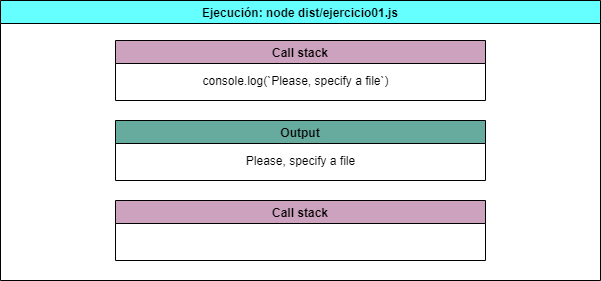
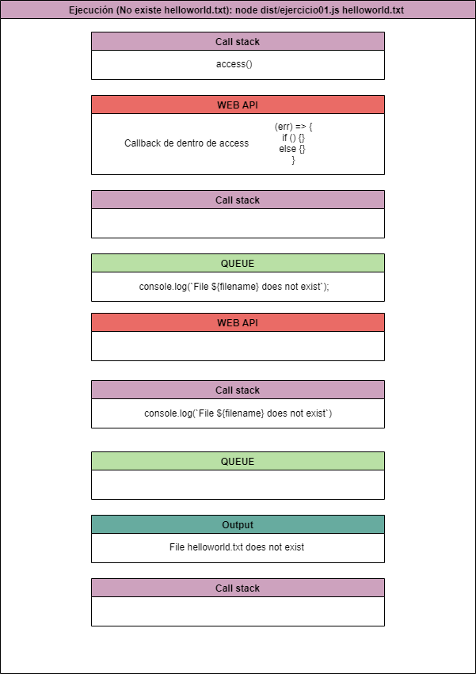
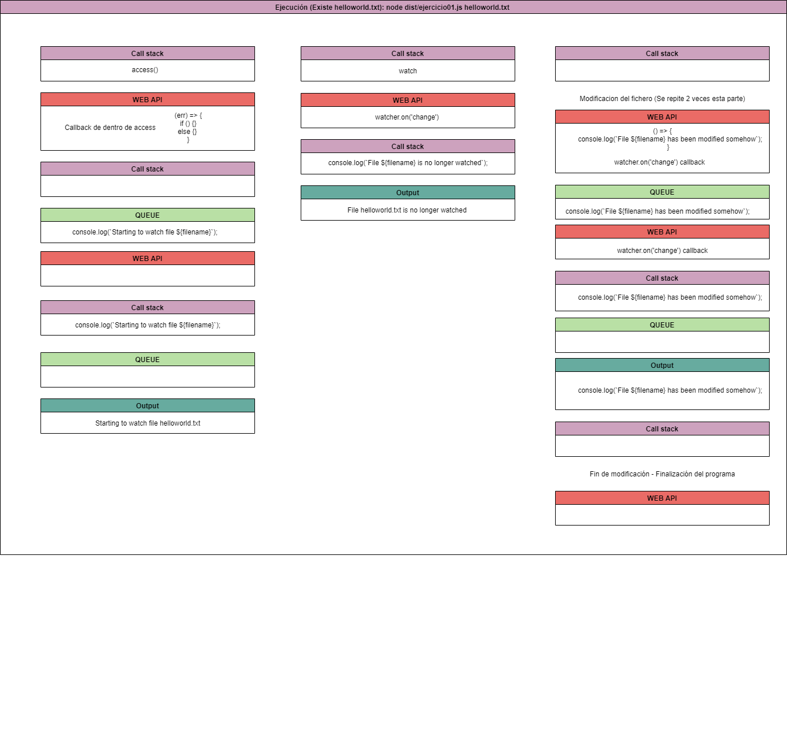

# Práctica 9 - Sistema de ficheros y creación de procesos en Node.js

## Tareas previas

Como tareas previas para el desarrollo de esta aplicación he estudiado la documentación correspondiente a la [API de callbacks proporcionada por Node.js para interactuar con el sistema de ficheros](https://nodejs.org/dist/latest/docs/api/fs.html#fs_callback_api) y también el [API asíncrona proporcionada por Node.js para crear procesos](https://nodejs.org/dist/latest/docs/api/child_process.html#child_process_asynchronous_process_creation).

## Ejercicio 1

Considerando el código proporcionado para este ejercicio:

```typescript
import { access, constants, watch } from "fs";

if (process.argv.length !== 3) {
  console.log("Please, specify a file");
} else {
  const filename = process.argv[2];

  access(filename, constants.F_OK, (err) => {
    if (err) {
      console.log(`File ${filename} does not exist`);
    } else {
      console.log(`Starting to watch file ${filename}`);

      const watcher = watch(process.argv[2]);

      watcher.on("change", () => {
        console.log(`File ${filename} has been modified somehow`);
      });

      console.log(`File ${filename} is no longer watched`);
    }
  });
}
```

He realizado una serie de diagramas que representan diferentes flujos de ejecución del programa dado.
El primer diagrama representa un flujo de ejecución donde no se especifica un fichero concreto, lo que propicia el consecuente error:



El segundo diagrama representa un flujo de ejecución donde si que se especifica un fichero concreto, pero en este caso dicho fichero no existe, por lo tanto, también se mostrará un error:



El último diagrama representa un flujo de ejecución donde el fichero especificado si existe, y por lo tanto se pueden ejecutar las correspondientes funciones asociadas al mismo:



### Respuesta a las preguntas del ejercicio 1

¿Qué hace la función access?

La función access testea los permisos de un usuario para un fichero o directorio especificado mediante una ruta, además de poder recibir también un argumento opcional que se corresponde con el modo. Por último recibe la callback invocada con un posible error como parámetro, de manera que se puede manejar así el flujo de ejecución en caso de que el valor de dicho parámetro sea distinto a `null`.

En este caso concreto, si existe un error se muestra un mensaje de que no se puedo acceder al fichero. De lo contrario, se mostrará un mensaje indicando que si se está vigilando el archivo, para posteriormente invocar al método watch sobre el fichero y también invocar un watch para cuando el evento sea de tipo `change`, de modo que si se modifica el archivo se ejecutará el código que contiene la callback de este último método.

Sin embargo, si no se realiza ningún cambio sobre el fichero a vigilar, simplemente el código sigue ejecutando el código y por lo tanto lo que muestra es el mensaje de que el fichero ya no está siendo observado, aunque esto es mentira, porque la función `watcher.on('change')` sigue corriendo y pendiente de cambios en el fichero.

¿Para qué sirve el objeto `constants`?
El objeto constants sirve para utilizar todo tipo de flags que indiquen si un fichero o directorio es visible, legible, editable o ejecutable por el proceso invocante. Hay una gran variedad de constantes, pero las usadas en el método access son precisamente las que comento: F_OK - visible flag, R_OK - read flag, W_OK - write flag, X_OK - execute flag.
