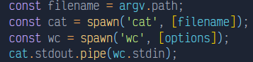
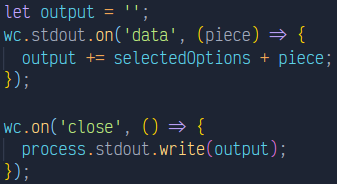
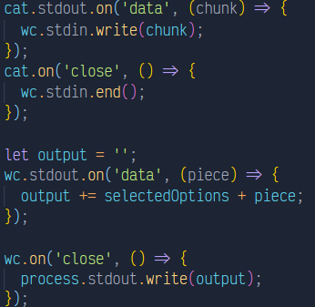

# Práctica 9 - Sistema de ficheros y creación de procesos en Node.js

## Tareas previas

Como tareas previas para el desarrollo de esta aplicación he estudiado la documentación correspondiente a la [API de callbacks proporcionada por Node.js para interactuar con el sistema de ficheros](https://nodejs.org/dist/latest/docs/api/fs.html#fs_callback_api) y también el [API asíncrona proporcionada por Node.js para crear procesos](https://nodejs.org/dist/latest/docs/api/child_process.html#child_process_asynchronous_process_creation).

## Ejercicio 1

Considerando el código proporcionado para este ejercicio:

```typescript
import { access, constants, watch } from "fs";

if (process.argv.length !== 3) {
  console.log("Please, specify a file");
} else {
  const filename = process.argv[2];

  access(filename, constants.F_OK, (err) => {
    if (err) {
      console.log(`File ${filename} does not exist`);
    } else {
      console.log(`Starting to watch file ${filename}`);

      const watcher = watch(process.argv[2]);

      watcher.on("change", () => {
        console.log(`File ${filename} has been modified somehow`);
      });

      console.log(`File ${filename} is no longer watched`);
    }
  });
}
```

He realizado una serie de diagramas que representan diferentes flujos de ejecución del programa dado.
El primer diagrama representa un flujo de ejecución donde no se especifica un fichero concreto, lo que propicia el consecuente error:


El segundo diagrama representa un flujo de ejecución donde si que se especifica un fichero concreto, pero en este caso dicho fichero no existe, por lo tanto, también se mostrará un error:


El último diagrama representa un flujo de ejecución donde el fichero especificado si existe, y por lo tanto se pueden ejecutar las correspondientes funciones asociadas al mismo:


### Respuesta a las preguntas del ejercicio 1

¿Qué hace la función access?

La función access testea los permisos de un usuario para un fichero o directorio especificado mediante una ruta, además de poder recibir también un argumento opcional que se corresponde con el modo. Por último recibe la callback invocada con un posible error como parámetro, de manera que se puede manejar así el flujo de ejecución en caso de que el valor de dicho parámetro sea distinto a `null`.

En este caso concreto, si existe un error se muestra un mensaje de que no se puedo acceder al fichero. De lo contrario, se mostrará un mensaje indicando que si se está vigilando el archivo, para posteriormente invocar al método watch sobre el fichero y también invocar un watch para cuando el evento sea de tipo `change`, de modo que si se modifica el archivo se ejecutará el código que contiene la callback de este último método.

Sin embargo, si no se realiza ningún cambio sobre el fichero a vigilar, simplemente el código sigue ejecutando el código y por lo tanto lo que muestra es el mensaje de que el fichero ya no está siendo observado, aunque esto es mentira, porque la función `watcher.on('change')` sigue corriendo y pendiente de cambios en el fichero.

¿Para qué sirve el objeto `constants`?
El objeto constants sirve para utilizar todo tipo de flags que indiquen si un fichero o directorio es visible, legible, editable o ejecutable por el proceso invocante. Hay una gran variedad de constantes, pero las usadas en el método access son precisamente las que comento: F_OK - visible flag, R_OK - read flag, W_OK - write flag, X_OK - execute flag.

## Ejercicio 2

Para este ejercicio el primer paso fue plantear el comando de terminal que me proporcionaría información sobre las líneas, palabras o caracteres de un fichero, siendo en este caso el comando `wc`.

Este comando, si se ejecuta en la terminal poniendo detrás un fichero, lo que mostrará por pantalla será tanto el número de lineas como el de palabras y caracteres, además del nombre del fichero. Pero también es de utilidad saber que el comando puede ser ejecutado con diversas opciones que permiten conseguir mostrar cada una de estos datos por separado:

- Opción `-l` - muestra el número de líneas
- Opción `-w` - muestra el número de palabras
- Opción `-m` - muestra el número de caracteres

Por lo tanto, ya sabemos que si gestionamos los comandos introducidos por la terminal, podemos seleccionar las opciones que queramos para ejecutar sobre nuestro fichero.

En este caso, como hay que plantear una solución en la que se use el método `pipe` de `Stream` y otra solución en la que no se use, lo que hize fue tener dos archivos separados, uno para cada solución.

### Ejercicio 2 - Primera solución

En la primera solución, hago `spawn` de un proceso `wc` con sus correspondientes opciones y de un proceso `cat`, con la intención de utilizar este último para mostrar el contenido del fichero, y redirigirlo por su salida estándar a la entrada estándar del comando `wc`.



De esta manera, podemos controlar mediante los streams de entrada y salida de `wc` qué es lo que queremos hacer con los datos que le han sido enviados. En este caso, almacenamos todos los datos en una variable y luego los mostramos en el evento `close` del comando `wc` haciendo uso de la salida estándar del `process` para escribir por pantalla.



Entre medio de estas operaciones he realizado algunas otras operaciones para formatear un poco la salida y que sea más elegante, pero no es relevante en cuestión de lo solicitado en el ejercicio.

### Ejercicio 2 - Segunda solución

En esta segunda solución hago spawn de los mismos procesos, sin embargo, como no puedo usar el métodos `pipe`, hago uso de los `Streams` para manejar los datos. Por lo tanto, la salida del comando `cat` la escribo en la entrada del comando `wc` y cuando he terminado de escribir envío también un evento de finalización de escritura para notificar a `wc` de que ya terminé de escribir. Luego simplemente voy acumulando la información recibida y al salir la escribo haciendo uso de la salida estándar del `process` para escribir por pantalla.



Cabe destacar que ambas soluciones se comportan exactamente igual ante las mismas entradas y que para el procesado de los comandos he utilizado el paquete `yargs`.

En cuanto al manejo de errores, he tratado de controlar todas las situaciones posibles como podrían ser rutas erróneas, falta de comandos a la hora de ejecutar el programa, entre otros.

## Ejercicio 3
